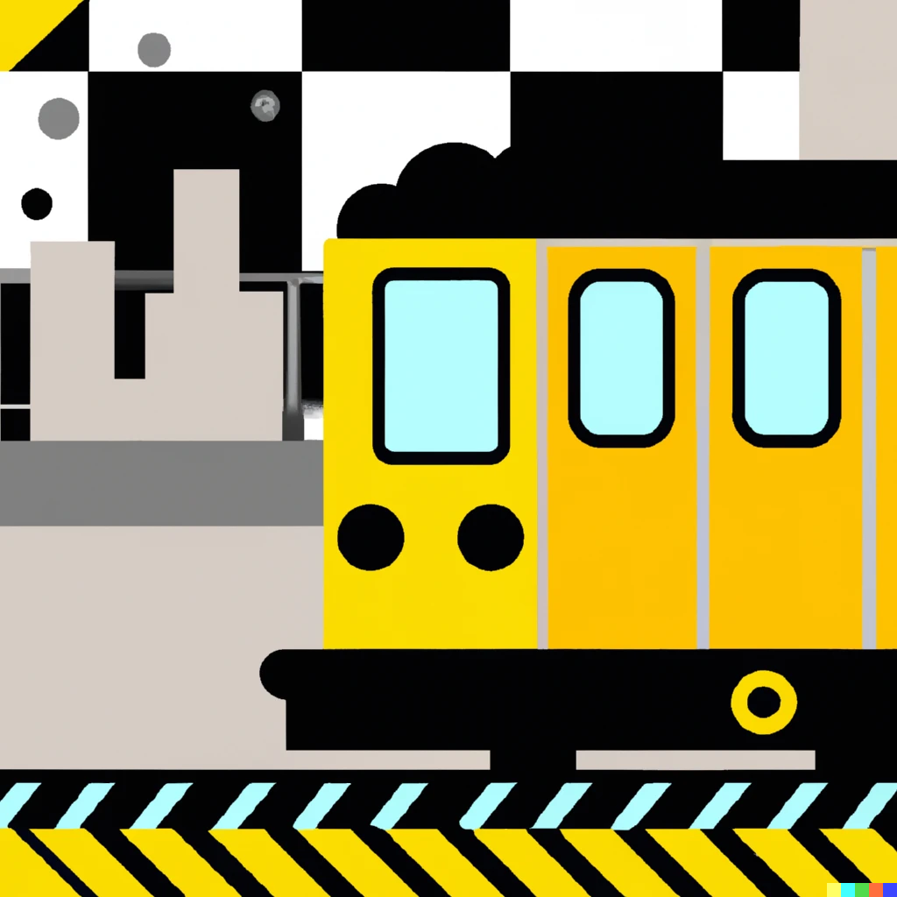

# subway-rs •   

Construct evm-based sandwich attacks using Rust and Huff.

#### Getting Started

> Before going further you should have the following packages installed on your system: Yarn, Cargo, Rust, Forge, Huff Compiler, Solc=0.8.15

[subway-rs](https://github.com/refcell/subway-rs) is a port of [libevm](https://twitter.com/libevm)'s original [subway](https://github.com/libevm/subway), implemented with [ethers-rs](https://github.com/gakonst/ethers-rs) and [huff](https://github.com/huff-language).

> Having highly optimized contracts is just one part of the equation, a tech stack is just as important as the contracts to execute on the opportunities.
> _Source: [libevm/subway](https://github.com/libevm/subway#subway)_

To improve upon the original tech stack, we use [rust](https://www.rust-lang.org/): the best language available for speed, dependability, and scalability (not biased).

This is [subway-rs](https://github.com/refcell/subway-rs): A pure-rust bot and Huff smart contracts used to execute sandwich attacks on UniswapV2.

The goal is to act as a low barrier of entry for huff and rust-based MEV development; a sort-of reference code for aspiring new searchers.

We're building it to be **fast**. But don't take our word for it, just check out the [benchmarks](./bot/benches).

Current capabilities:

- Watch pending transactions in the mempool.
- Decode Transaction data for Uniswap V2 Calls. (and more soon!)
- Search for profitable strategies efficiently using a variety of algorithms.
- Calculate gas bribes.
- Simulate and Execute Flashbot Bundles.
- Verbose telemetry reporting using [tracing](https://crates.io/crates/tracing).

#### Future Improvements

> **Note**
>
> Be aware, this bot is intended to be educational content and not for production use.

Although the bot functions, it is simplistic and _certainly_ not competitive. Accept that advanced searchers to already be executing far beyond the current capabilities.

That being said, a list of future improvements are tagged with the `feat:` prefix in the [issues section](https://github.com/refcell/subway-rs/issues) of this repository.

#### Contributing

All contributions are welcome!

Please reach out to [asnared](https://twitter.com/asnared) on twitter or [open an issue](https://github.com/refcell/subway-rs/issues/new) for any questions, improvements, or bugs.

#### Attributions

- [subway](https://github.com/libevm/subway)
- [mev-template-rs](https://github.com/DeGatchi/mev-template-rs)
- [foundry](https://github.com/foundry-rs/foundry)
- [forge-std](https://github.com/brockelmore/forge-std)
- [foundry-huff](https://github.com/foundry-rs/foundry-huff)

#### Noteworthy Mentions

- [quay](https://github.com/Alcibiades-Capital/quay)
- [merkle-generator](https://github.com/DeGatchi/merkle-generator)
- [flashloans-toolbox](https://github.com/Supercycled/flashloans-toolbox)
- [Cake Sniper](https://github.com/Supercycled/cake_sniper)
- [searcher-examples](https://github.com/jito-labs/searcher-examples)
- [simple-arbitrage-rs](https://github.com/thasarito/simple-arbitrage-rs)
- [mev-bundle-generator](https://github.com/Alcibiades-Capital/mev_bundle_generator)
