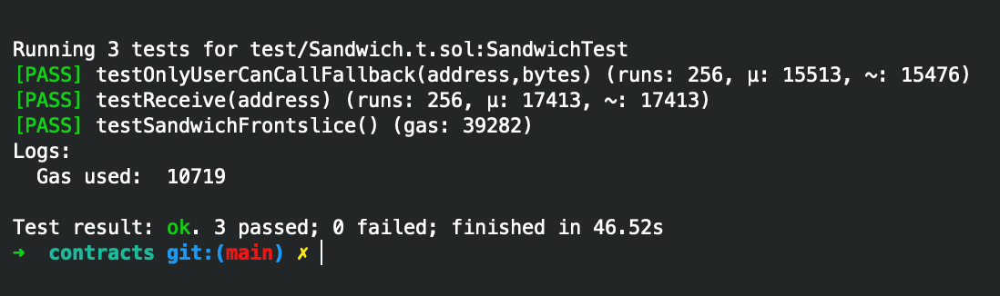

# subway-rs/contracts • [](https://github.com/abigger87/subway-rs/actions/workflows/ci.yaml)   


A highly optimized [huff](https://github.com/huff-language) contract that can be used for front and back slices in a UniswapV2 [sandwich attack](https://medium.com/coinmonks/defi-sandwich-attack-explain-776f6f43b2fd).


> **Warning**
>
> Please be aware that this repository does NOT provide protection against [Uncle Bandit attacks](https://twitter.com/bertcmiller/status/1385294417091760134).
>
> Although contracts have been rigorously reviewed, this is **experimental software** and is provided on an "as is" and "as available" basis. Contracts are **unaudited**.
> We **do not give any warranties** and **will not be liable for any loss** incurred through any use of this codebase.


### Gas Usage

As shown below, the subway-rs [Huff Contract](./src/Sandwich.huff) offers gas improvements of up to **9 times** the original subway's [most optimized contract](https://github.com/libevm/subway/blob/master/contracts/src/Sandwich.yulp).



| Single Swap                       | Gas Used | Who        |
| --------------------------------- | -------- | ---------- |
| Univ2 Router                      | 109809   | uniswap    |
| Solidity Inline Assembly Contract | 92422    | subway     |
| Yulp Contracts                    | 92234    | subway     |
| Huff Contract                     | 10719    | subway-rs  |


### Usage

_Just Use [Foundry](https://getfoundry.sh)._


### Blueprint

```ml
.
├─ src
│  └─ Subway.huff — The Subway Contract written in Huff
└─ test
   └─ Subway.t.sol — Exhaustive Tests for Subway.huff
```


### Acknowledgements

- [subway](https://github.com/libevm/subway)
- [huffplate](https://github.com/abigger87/huffplate)
- [huff-language](https://github.com/huff-language)
- [forge-std](https://github.com/brockelmore/forge-std)
- [forge-template](https://github.com/foundry-rs/forge-template)
- [foundry-toolchain](https://github.com/foundry-rs/foundry-toolchain)
